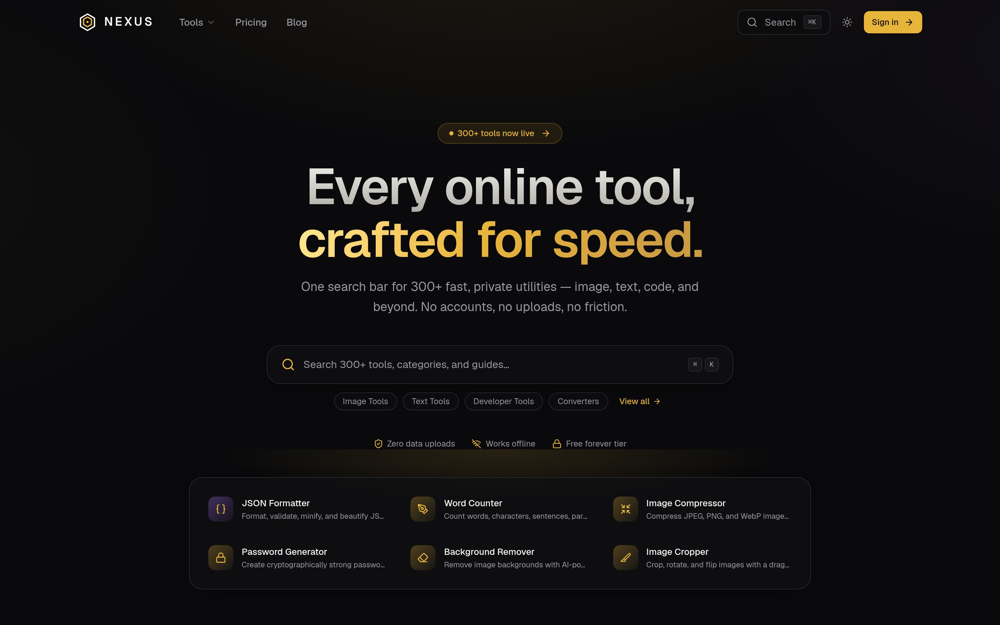
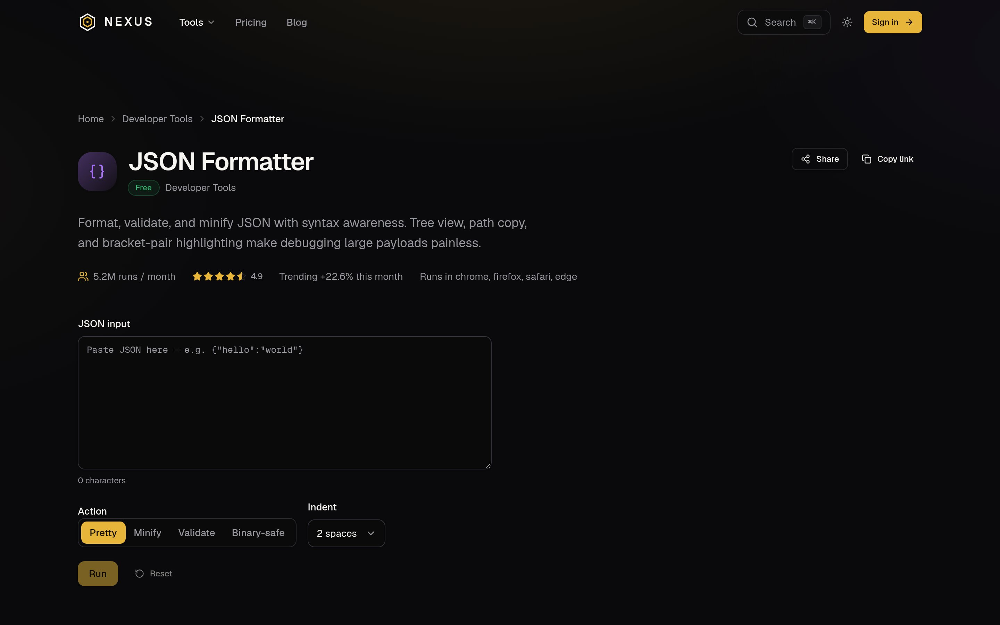
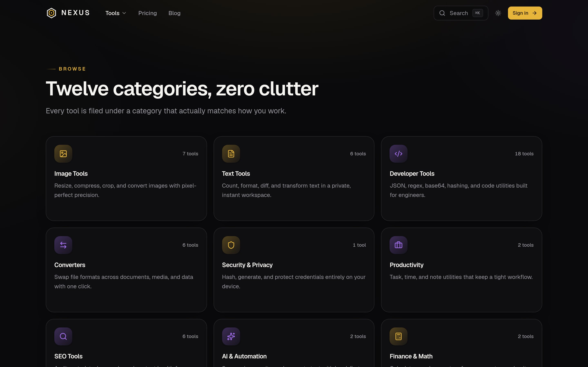
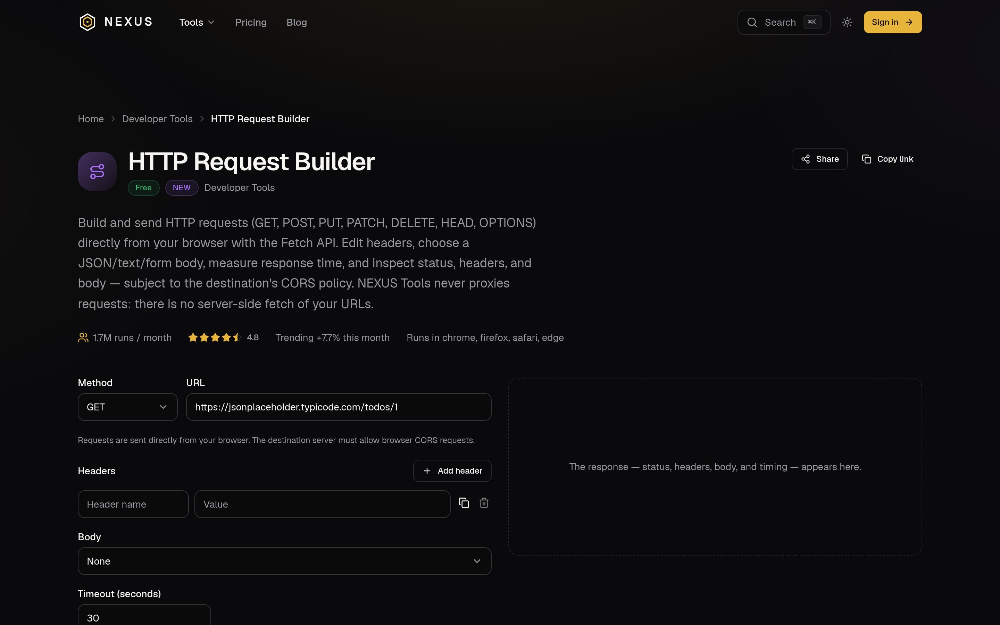
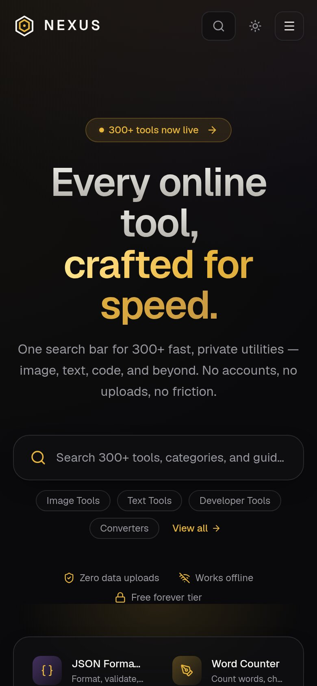
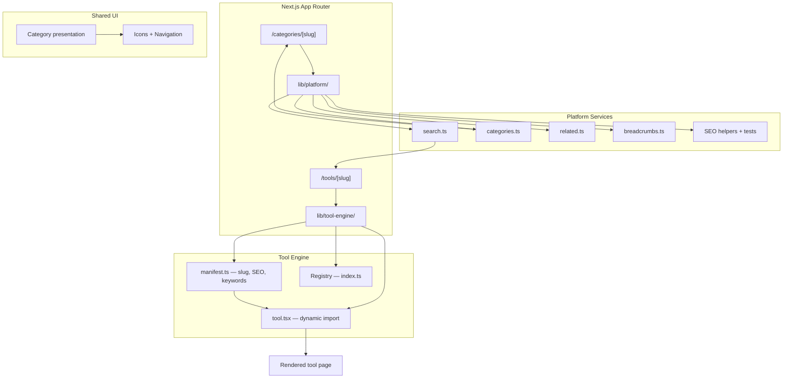

# NEXUS Tools

[](https://github.com/nexusauth0-cloud/nexus-tools/actions/workflows/ci.yml)

A suite of 55 browser-based tools — image, text, developer, converter, SEO, document, finance, AI, and productivity utilities — built as a single Next.js application on a shared tool-engine architecture.

Every tool runs client-first: processing happens in the browser wherever technically possible, so results are instant and files stay on the device.

**Stack:** Next.js (App Router) · React · TypeScript · Tailwind CSS · Radix UI · Zustand · Zod · Vitest

---

## Why This Project Exists

NEXUS Tools is an exercise in product architecture at scale. Fifty-five tools could be fifty-five copies of the same boilerplate — instead, this project treats each tool as a **manifest + component** registered into a shared engine that handles discovery, search, categorization, SEO metadata, PWA caching, and analytics.

The interesting engineering is not any single tool; it's the platform that makes adding tool #56 cheap.

## Available Tools

| Category | Count | Examples |
|---|---|---|
| Developer | 18 | JSON formatter/validator, regex tester, JWT decoder, hash generator, UUID, URL parser, HTTP request/headers |
| Image | 7 | Compressor, resizer, cropper, converter, background remover, PNG↔WebP, metadata viewer |
| Text | 6 | Word counter, case converter, text differ, lorem ipsum, markdown preview, summarizer |
| Converters | 6 | JSON↔CSV, YAML, base64, epoch, unit, currency |
| SEO | 6 | Meta tag analyzer, robots.txt checker, sitemap checker, keyword density |
| Document | 5 | PDF to text, text to PDF, PDF metadata/page counter |
| Finance & Math | 2 | Currency converter, deadline calculator |
| AI & Automation | 2 | Paraphrase tool, text summarizer |
| Productivity | 2 | Pomodoro timer, password generator |
| Security & Privacy | 1 | Password/credential generators |

Planned categories (`video`, `audio`, `social`) are already defined in the category system and will fill in over time.

## Product Preview

### Tool Dashboard



### JSON Formatter



### Categories



### HTTP Request Tool



### Mobile Experience



## Architecture



Each tool lives in its own folder under `tools/<slug>/` with a declarative `manifest.ts` and a dynamically-imported `tool.tsx`. The engine handles routing and rendering; the platform layer provides search, categories, and SEO.

Key decisions:

- **Manifest-driven** — each tool declares its own metadata; category pages, search, counts, and sitemaps are derived from the registry rather than duplicated
- **Dynamic imports** — tool components load on demand, keeping initial bundle cost independent of the number of tools
- **Client-first processing** — file/text transformations run in-browser; nothing is uploaded for the core workflows
- **PWA** — service worker + offline shell via `next-pwa`, installable on mobile/desktop

## Getting Started

### Prerequisites

- Node.js 20+
- npm

### Install & run

```bash
git clone https://github.com/nexusauth0-cloud/nexus-tools.git
cd nexus-tools
npm install
npm run dev        # http://localhost:3000
```

## Scripts

| Script | Purpose |
|---|---|
| `npm run dev` | Development server |
| `npm run build` | Production build |
| `npm start` | Serve the production build |
| `npm run typecheck` | TypeScript, no emit |
| `npm run lint` | ESLint |
| `npm run format` / `format:check` | Prettier |
| `npm test` | Vitest suite (registry, search, categories, validation, parsers) |
| `npm run icons` | Regenerate PWA icons from source assets |

## Testing

Unit tests cover the platform layer — the registry, search ranking, category derivation, route validation, SEO output, and shared parsers (JSON, YAML, formatting). Run them with:

```bash
npm test
```

## Adding a Tool

1. Create `src/tools/<slug>/manifest.ts` using `defineToolManifest`
2. Add the tool UI component
3. Register both in `src/tools/index.ts`

Category pages, search, related-tool links, counts, and metadata update automatically.

## Deployment

Standard Next.js deployment — build with `npm run build` and host on Vercel or any Node.js-compatible platform.

## License

Released under the [MIT License](LICENSE).
